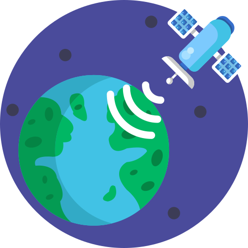

<!-- PROJECT SUMMARY -->
<p align="center">
    
<h2 align="center">Satellighte</h2>
<h4 align="center">Satellite Image Classification</h4>

<p align="center">
    <strong>
        <a href="Project_Website">Website</a>
        •
        <a href="Project_Docs">Docs</a>
        •
        <a href="Project_Demo">Demo</a>
    </strong>
</p>

<!-- TABLE OF CONTENTS -->
<details>
    <summary>
        <strong>
            TABLE OF CONTENTS
        </strong>
    </summary>
    <ol>
        <li>
            <a href="#about-the-satellighte">About The Satellighte</a>
        </li>
        <li>
            <a href="##prerequisites">Prerequisites</a>
        </li>
        <li>
            <a href="#installation">Installation</a>
            <ul>
                <li><a href="#from-pypi">From Pypi</a></li>
                <li><a href="#from-source">From Source</a></li>
            </ul>
        </li>
        <li><a href="#usage-examples">Usage Examples</a></li>
        <li><a href="#tests">Tests</a></li>
        <li><a href="#contributing">Contributing</a></li>
        <li><a href="#contributors">Contributors</a></li>
        <li><a href="#contact">Contact</a></li>
        <li><a href="#license">License</a></li>
        <li><a href="#references">References</a></li>
        <li><a href="#citations">Citations</a></li>
    </ol>
</details>

<!-- ABOUT THE PROJECT -->
## About The Satellighte

This repo is prepared to present your projects in an understandable and beautiful view.

_Source: [readme-template](https://github.com/canturan10/readme-template)_

<!-- PREREQUISITES -->
## Prerequisites

Before you begin, ensure you have met the following requirements:
| requirement   | version |
| ------------- | ------- |
| requirement_1 | >=0.0.8 |
| requirement_2 | ~=1.3.0 |

<!-- INSTALLATION -->
## Installation

To install Satellighte, follow these steps:

### From Pypi

```bash
pip install requirement_1
```

### From Source

```bash
git clone https://github.com/canturan10/readme-template
cd requirement_1
pip install .
```
<!-- USAGE EXAMPLES -->
## Usage Examples

A few motivating and useful examples of how your project can be used. Spice this up with additional screenshots, code examples and demos.

_For more examples, please refer to the [Documentation](https://github.com/canturan10/readme-template)

<!-- TESTS -->
## Tests

During development, you might like to have tests run on every file.

```bash
pytest tests
```

<!-- CONTRIBUTING -->
## Contributing

To contribute to `Satellighte`, follow these steps:

1. Fork this repository.
2. Create a branch: `git checkout -b <branch_name>`.
3. Make your changes and commit them: `git commit -m '<commit_message>'`
4. Push to the original branch: `git push origin`
5. Create the pull request.

Alternatively see the `GitHub` documentation on [creating a pull request](https://help.github.com/en/github/collaborating-with-issues-and-pull-requests/creating-a-pull-request).

<!-- CONTRIBUTORS -->
## Contributors

<table style="width:100%">
    <tr>
        <td align="center">
            <a href="https://github.com/canturan10">
                <h3>
                    Oğuzcan Turan
                </h3>
                <br>
                <a href="https://www.linkedin.com/in/canturan10/">
                    
                </a>
                <a href="https://canturan10.github.io/">
                    
                </a>
            </a>
        </td>
        <td align="center">
            <a href="https://github.com/canturan10">
                <h3>
                    You ?
                </h3>
                <br>
                <a href="#">
                    
                </a>
            </a>
        </td>
    </tr>
</table>

<!-- CONTACT -->
## Contact

If you want to contact me you can reach me at [can.turan.10@gmail.com](mailto:can.turan.10@gmail.com).

<!-- LICENSE -->
## License

This project is licensed under `MIT` license. See [`LICENSE`](LICENSE) for more information.

<!-- REFERENCES -->
## References

The references used in the development of the project are as follows.

- [Img Shields](https://shields.io)
- [GitHub Pages](https://pages.github.com)

<!-- CITATIONS -->
## Citations

```bibtex
@inproceedings{Lorem,
   author={Lorem ipsum dolor sit amet},
   year={2021},
   title={Lorem ipsum dolor sit amet}
}
```

Give a ⭐️ if this project helped you!

_This readme file is made using the [readme-template](https://github.com/canturan10/readme-template)_
